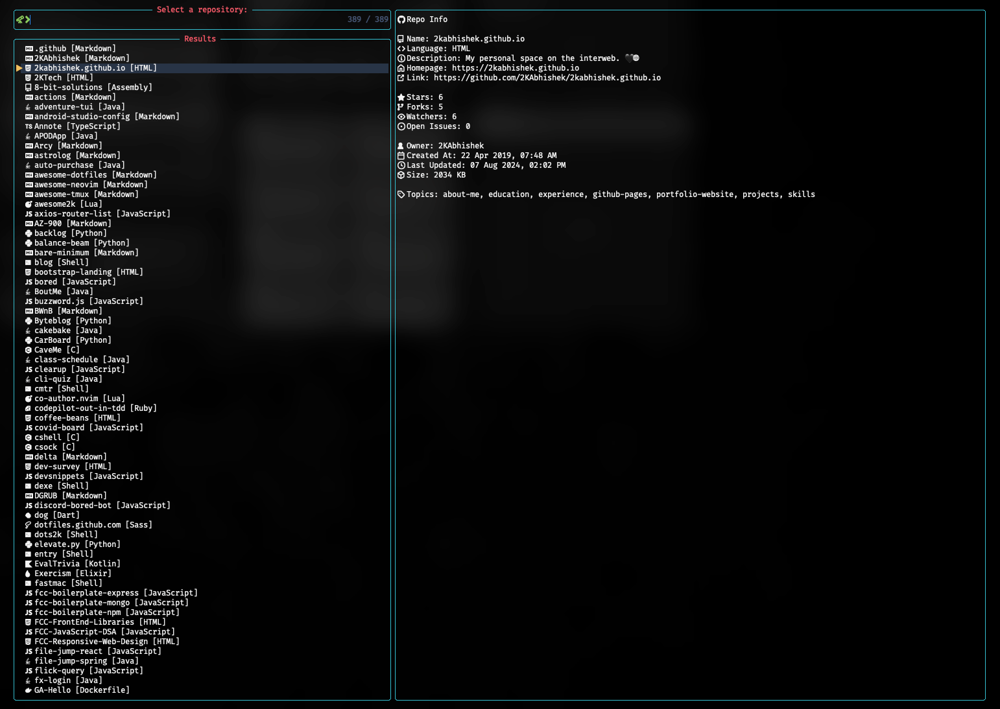
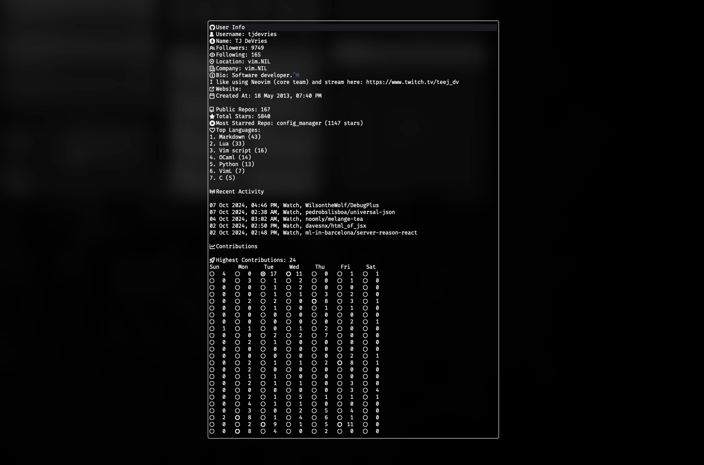

<div align = "center">

<h1><a href="https://github.com/2kabhishek/octohub.nvim">octohub.nvim</a></h1>

<a href="https://github.com/2KAbhishek/octohub.nvim/blob/main/LICENSE">
 </a>

<a href="https://github.com/2KAbhishek/octohub.nvim/graphs/contributors">
 </a>

<a href="https://github.com/2KAbhishek/octohub.nvim/stargazers">
</a>

<a href="https://github.com/2KAbhishek/octohub.nvim/network/members">
 </a>

<a href="https://github.com/2KAbhishek/octohub.nvim/watchers">
 </a>

<a href="https://github.com/2KAbhishek/octohub.nvim/pulse">
 </a>

<h3>All Your GitHub repos and more in Neovim 🐙🛠️</h3>

<figure>
  
  <br/>
  <figcaption>octohub.nvim repo picker</figcaption>
</figure>

<figure>
  
  <br/>
  <figcaption>octohub.nvim stats window</figcaption>
</figure>

</div>

**octohub.nvim** is a Neovim plugin for managing and exploring GitHub repositories directly within the editor. It lets you view, filter, and sort repositories, track activity, and access profile and contribution stats, all without leaving Neovim.

## ✨ Features

[Video walkthrough of features](https://youtu.be/Sebh2aFfFPg)

- Quickly list and open any GitHub repositories, yours, or others, directly from Neovim.
- Sort repositories by stars, forks, and other criteria, with support for filtering by type (forks, private repos, etc.) and languages.
- View all sorts of repository details at a glance, including issues, stars, forks, and more.
- Seamless integration with pickers for fuzzy searching and quick access to repositories.
- Display GitHub profile stats including recent activity and contributions for any user.
- View repository statistics, such as top languages and contribution metrics.
- Customizable display options for activity, contribution graphs, and repo stats.

## ⚡ Setup

### ⚙️ Requirements

- [utils.nvim](https://github.com/2kabhishek/utls.nvim) for helper functions
- [pickme.nvim](https://github.com/2kabhishek/pickme.nvim) for picker support
- The GitHub CLI tool (`gh`)

- [tmux-tea](https://github.com/2kabhishek/tmux-tea) (optional) if you want to use individual sessions for each repository
  - Using `set -g @tea-default-command 'nvim'` is recommended

### 💻 Installation

```lua
-- Lazy nvim
{
    '2kabhishek/octohub.nvim',
    cmd = { 'Octohub' },
    keys = { '<leader>goo' }, -- Add more bindings as needed
    dependencies = {
        '2kabhishek/utils.nvim',
        '2kabhishek/pickme.nvim',
    },
    -- Add your custom configs here, keep it blank for default configs (required)
    opts = {},
},
```

## 🚀 Usage

### Configuration

octohub.nvim can be configured using the following options:

```lua
local octohub = require('octohub')

octohub.setup({
    repos = {
        per_user_dir = true,          -- Create a directory for each user
        projects_dir = '~/Projects/', -- Directory where repositories are cloned
        sort_by = '',                 -- Sort repositories by various parameters
        repo_type = '',               -- Type of repositories to display
        language = '',                -- Repositories language filter
    },
    stats = {
        contribution_icons = { '', '', '', '', '', '', '' }, -- Icons for different contribution levels
        max_contributions = 50,       -- Max number of contributions per day to use for icon selection
        top_lang_count = 5,           -- Number of top languages to display in stats
        event_count = 5,              -- Number of activity events to show
        window_width = 90,            -- Width in percentage of the window to display stats
        window_height = 60,           -- Height in percentage of the window to display stats
        show_recent_activity = true,  -- Show recent activity in the stats window
        show_contributions = true,    -- Show contributions in the stats window
        show_repo_stats = true,       -- Show repository stats in the stats window
    },
    cache = {
        events = 3600 * 6,            -- Time in seconds to cache activity events
        contributions = 3600 * 6,     -- Time in seconds to cache contributions data
        repos = 3600 * 24 * 7,        -- Time in seconds to cache repositories
        username = 3600 * 24 * 7,     -- Time in seconds to cache username
        user = 3600 * 24 * 7,         -- Time in seconds to cache user data
    },
    add_default_keybindings = true,   -- Add default keybindings for the plugin
    use_new_command = false,          -- Use the new `Octohub` command
})
```

Available `repos.sort_by` options:

- `created` - Sort by creation date, `:Octohub repos sort:created`
- `forks` - Sort by forks, `:Octohub repos sort:forks`
- `issues` - Sort by open issues, `:Octohub repos sort:issues`
- `language` - Sort by language, `:Octohub repos sort:language`
- `name` - Sort by name, `:Octohub repos sort:name`
- `pushed` - Sort by last push, `:Octohub repos sort:pushed`
- `size` - Sort by size, `:Octohub repos sort:size`
- `stars` - Sort by stars, `:Octohub repos sort:stars`
- `updated` - Sort by last update, `:Octohub repos sort:updated`

Available `repos.repo_type` options:

- `archived` - Archived repositories, `:Octohub repos type:archived`
- `forked` - Forked repositories, `:Octohub repos type:forked`
- `private` - Private repositories, `:Octohub repos type:private`
- `starred` - Starred repositories, `:Octohub repos type:starred`
- `template` - Template repositories, `:Octohub repos type:template`

`repos.language` can be set to any programming language, such as `python`, `javascript`, etc. This will filter repositories by the specified language.

> Note: The `repos.sort_by` and `repos.repo_type` options match the start of keywords, you can expand them for readability, `sort:updated` is same as `sort:update`.

### Commands

`octohub.nvim` provides a unified command interface with tab completion support:

#### Main Commands

- `:Octohub repos [user] [sort:<option>] [type:<option>] [lang:<language>]`: Displays repositories for a given user, sorted by specified criteria.
  - Ex: `:Octohub repos 2kabhishek sort:updated type:forked` - Display all forked repositories for `2kabhishek`, sorted by last update.
  - Ex: `:Octohub repos type:starred` - Display all repositories starred by the current user.
  - Ex: `:Octohub repos lang:javascript` - Display all JavaScript repositories for the current user.
  - Ex: `:Octohub` - Same as `:Octohub repos` for the current user.
  - `:Octohub repos languages [user]`: Opens an interactive language picker to filter repositories by programming language.
    - Ex: `:Octohub repos languages` - Show language picker for the current user.
    - Ex: `:Octohub repos languages 2kabhishek` - Show language picker for user `2kabhishek`.
- `:Octohub repo <name>` or `:Octohub repo <owner/name>`: Opens a specified repository.
  - Ex: `:Octohub repo octohub.nvim` - Clone the repository `octohub.nvim` from the current user.
  - Ex: `:Octohub repo 2kabhishek/octohub.nvim` - Clone the repository `octohub.nvim` from the user `2kabhishek`.
- `:Octohub stats [user]`: Displays all stats (activity, contributions, repository data).
  - Ex: `:Octohub stats theprimeagen` shows stats for `theprimeagen`.
- `:Octohub stats activity [user] [count:N]`: Displays recent activity for a user, with an optional count.
  - Ex: `:Octohub stats activity count:20` shows the last 20 activity events for the current user.
- `:Octohub stats contributions [user]`: Displays contribution stats for a user.
- `:Octohub stats repo [user]`: Displays statistics for the repositories of a given user.
  - Ex: `:Octohub stats repo 2kabhishek` - Display statistics for the repositories of the user `2kabhishek`.
- `:Octohub web profile [user]`: Opens the GitHub profile of a user in your browser.
- `:Octohub web repo`: Opens the current repository in the browser.

#### Command Completion

All new `Octohub` commands support tab completion:

- Subcommands: `repos`, `repo`, `stats`, `web`
- `repos`: `sort:created`, `sort:forks`, `type:archived`, `type:private`, `lang:javascript`, etc. `lang` completions are powered by your repos' languages.
- `repo`: provides completion for your own repo names
- `stats`: `activity`, `contributions`, `repo`
- `web`: `profile`, `repo`

#### Utility Commands

- `UtilsClearCache[prefix]`: Clears all the cache for a given prefix. Provided by [utils.nvim](https://github.com/2kabhishek/utils.nvim).
  - Ex: `:UtilsClearCache username` - Clears the cache for `username`

If the `user` parameter is not provided, the plugin will use the current authenticated username from `gh`

#### Deprecated Commands (Backward Compatibility)

> **⚠️ DEPRECATION NOTICE**: The following commands are deprecated and will be removed in a future version. Please migrate to the new `Octohub` commands above.
> More information: https://github.com/2kabhishek/octohub.nvim/issues/13

The original commands are still available for backward compatibility:

- `:OctoRepos`, `:OctoRepo`, `:OctoStats`, `:OctoActivityStats`, `:OctoContributionStats`, `:OctoRepoStats`, `:OctoProfile`, `:OctoRepoWeb`
- All the `OctoReposBy*` and `OctoReposType*` commands

**Migration Guide:**

- `:OctoRepos` → `:Octohub repos`
- `:OctoReposBySize` → `:Octohub repos sort:size`
- `:OctoReposTypePrivate` → `:Octohub repos type:private`
- `:OctoRepo` → `:Octohub repo`
- `:OctoStats` → `:Octohub stats`
- `:OctoActivityStats` → `:Octohub stats activity`
- `:OctoContributionStats` → `:Octohub stats contributions`
- `:OctoRepoStats` → `:Octohub stats repo`
- `:OctoProfile` → `:Octohub web profile`
- `:OctoRepoWeb` → `:Octohub web repo`

### Keybindings

By default, these are the configured keybindings.

| Keybinding    | Command                            | Description          |
| ------------- | ---------------------------------- | -------------------- |
| `<leader>goo` | `:Octohub repos<CR>`               | All Repos            |
| `<leader>gob` | `:Octohub repos sort:size<CR>`     | Repos by Size        |
| `<leader>goc` | `:Octohub repos sort:created<CR>`  | Repos by Created     |
| `<leader>gof` | `:Octohub repos sort:forks<CR>`    | Repos by Forks       |
| `<leader>goi` | `:Octohub repos sort:issues<CR>`   | Repos by Issues      |
| `<leader>gol` | `:Octohub repos sort:language<CR>` | Repos by Language    |
| `<leader>gos` | `:Octohub repos sort:stars<CR>`    | Repos by Stars       |
| `<leader>gou` | `:Octohub repos sort:updated<CR>`  | Repos by Updated     |
| `<leader>goU` | `:Octohub repos sort:pushed<CR>`   | Repos by Pushed      |
| `<leader>goA` | `:Octohub repos type:archived<CR>` | Archived Repos       |
| `<leader>goF` | `:Octohub repos type:forked<CR>`   | Forked Repos         |
| `<leader>goP` | `:Octohub repos type:private<CR>`  | Private Repos        |
| `<leader>goS` | `:Octohub repos type:starred<CR>`  | Starred Repos        |
| `<leader>goT` | `:Octohub repos type:template<CR>` | Template Repos       |
| `<leader>goL` | `:Octohub repos languages<CR>`     | Filter by Language   |
| `<leader>goa` | `:Octohub stats activity<CR>`      | Activity Stats       |
| `<leader>gog` | `:Octohub stats contributions<CR>` | Contribution Graph   |
| `<leader>gor` | `:Octohub stats repo<CR>`          | Repo Stats           |
| `<leader>got` | `:Octohub stats<CR>`               | All Stats            |
| `<leader>gop` | `:Octohub web profile<CR>`         | Open GitHub Profile  |
| `<leader>gow` | `:Octohub web repo<CR>`            | Open Repo in Browser |

I recommend customizing these keybindings based on your preferences.

You can also add the following to your `which-key` configuration: `{ '<leader>go', group = 'Octohub' },`

### Telescope Integration

`octohub.nvim` adds a Telescope extension for easy searching and browsing of repositories.

> Make sure that you define the `picker_provider` as `telescope` in your pickme.nvim configuration.

To use this extension, add the following code to your configuration:

```lua
local telescope = require('telescope')

telescope.load_extension('repos')
```

You can now use the following command to show repositories in Telescope: `:Telescope repos`

### Help

Run `:help octohub` to view these docs in Neovim.

## 🏗️ What's Next

- [ ] Add more tests
- You tell me!

## ⛅ Behind The Code

### 🌈 Inspiration

I use GitHub quite a bit and wanted to get all of my most used activities done from Neovim.

### 💡 Challenges/Learnings

- The main challenges were figuring out how to interact with the GitHub API and how to display the data in a user-friendly way.
- I learned about Lua's powerful features for handling data structures and Neovim's extensibility.

### 🔍 More Info

- [nerdy.nvim](https://github.com/2kabhishek/nerdy.nvim) — Find nerd glyphs easily
- [tdo.nvim](https://github.com/2kabhishek/tdo.nvim) — Fast and simple notes in Neovim
- [termim.nvim](https://github.com/2kabhishek/termim.nvim) — Neovim terminal improved

<hr>

<div align="center">

<strong>⭐ hit the star button if you found this useful ⭐</strong><br>

<a href="https://github.com/2kabhishek/octohub.nvim">Source</a>
| <a href="https://2kabhishek.github.io/blog" target="_blank">Blog </a>
| <a href="https://twitter.com/2kabhishek" target="_blank">Twitter </a>
| <a href="https://linkedin.com/in/2kabhishek" target="_blank">LinkedIn </a>
| <a href="https://2kabhishek.github.io/links" target="_blank">More Links </a>
| <a href="https://2kabhishek.github.io/projects" target="_blank">Other Projects </a>

</div>
